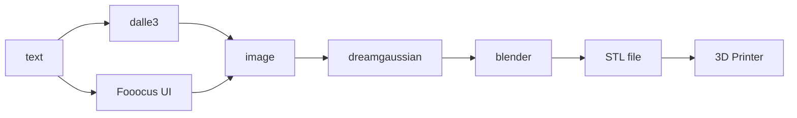
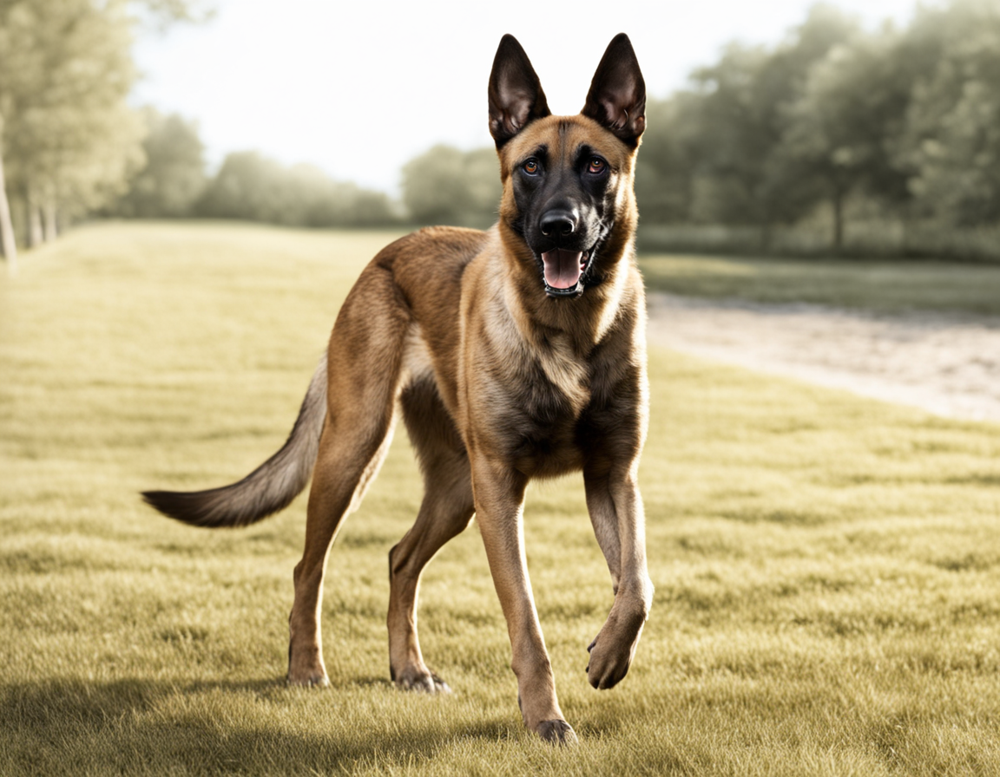
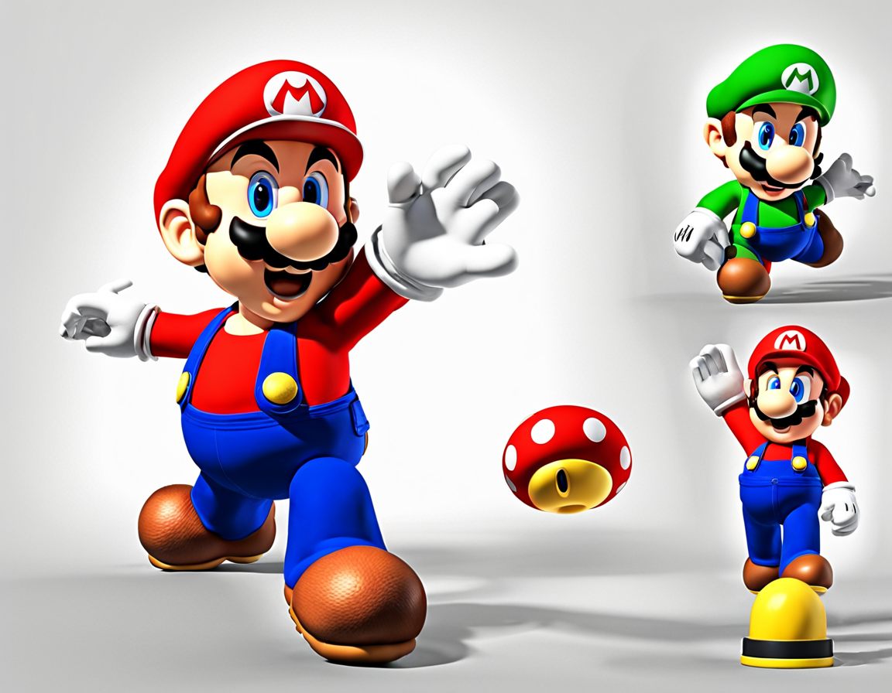
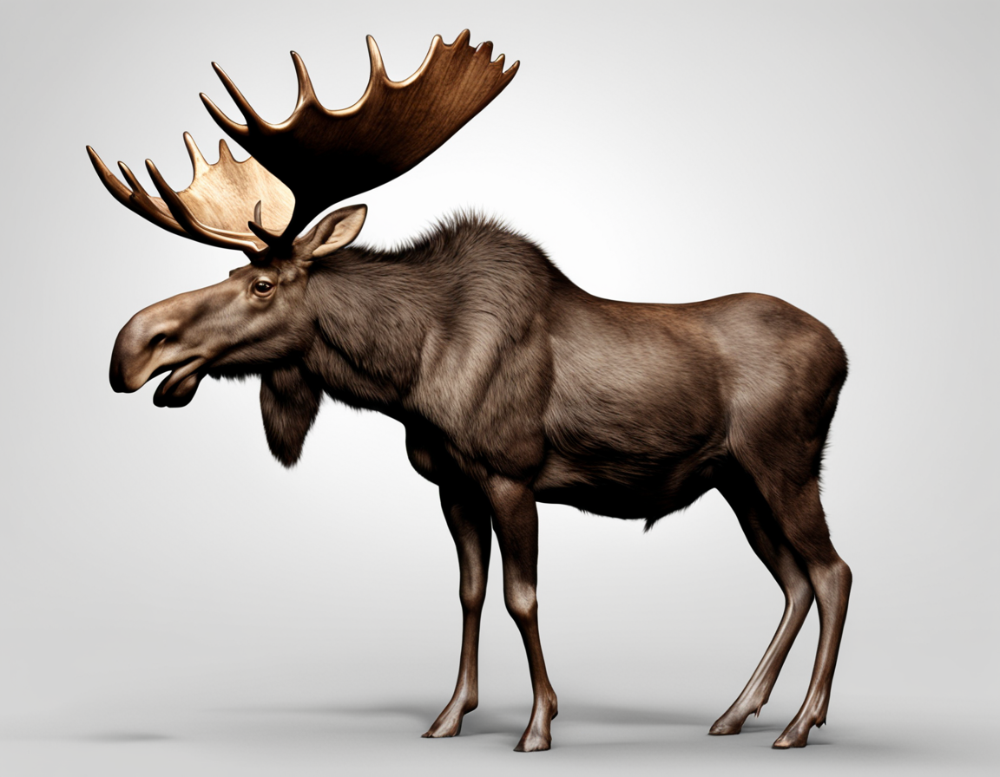
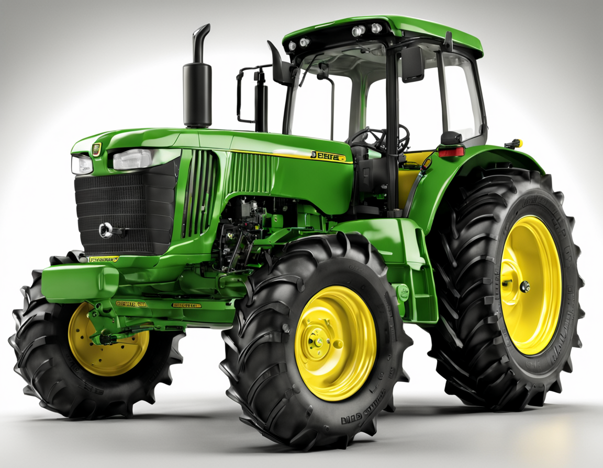
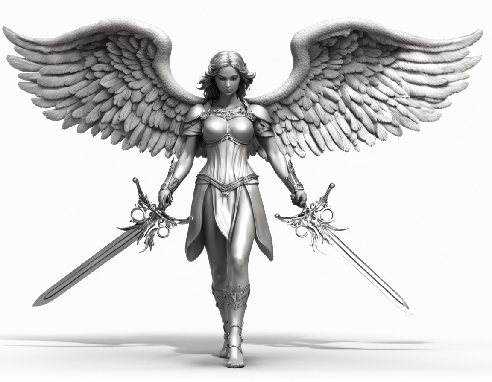
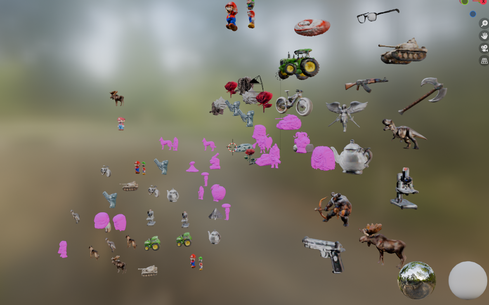
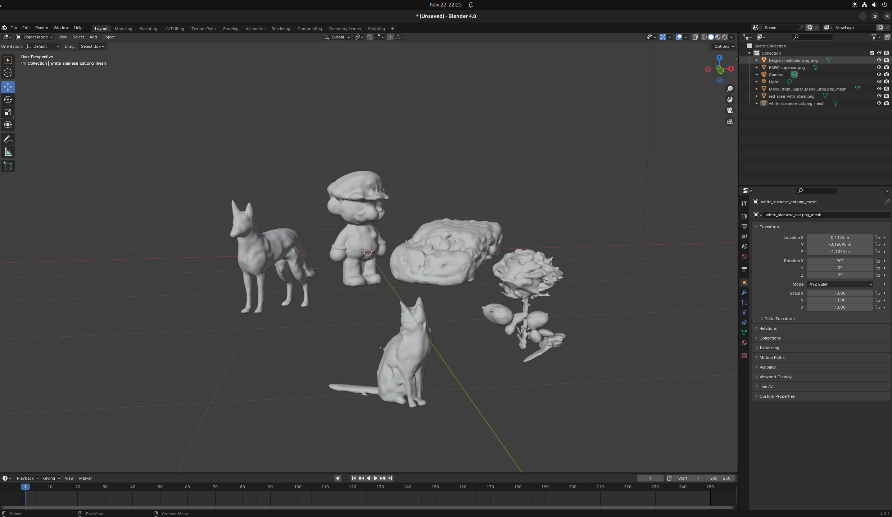

# generate-ornaments-from-text

## Overview

Its almost Christmas time and I wanted to make see if any of the recent AI developments could help gifts. After learning
about dreamgaussian, I thought it would be fun to generate ornaments for the christmas tree.

This project glues together dreamgaussian, dalle3 (or other text to image models), and blender to generate 3D models.

The basic pipeline is one of:



## Images

    

## 3D Models in Blender





## Usage

```bash
# Generate images to ./images
python3 get_images.py

# For each PNG, run the dreamgaussian pipeline against it
bash generate_3d_objects.sh <image_directory> <3d_model_output_directory>
```