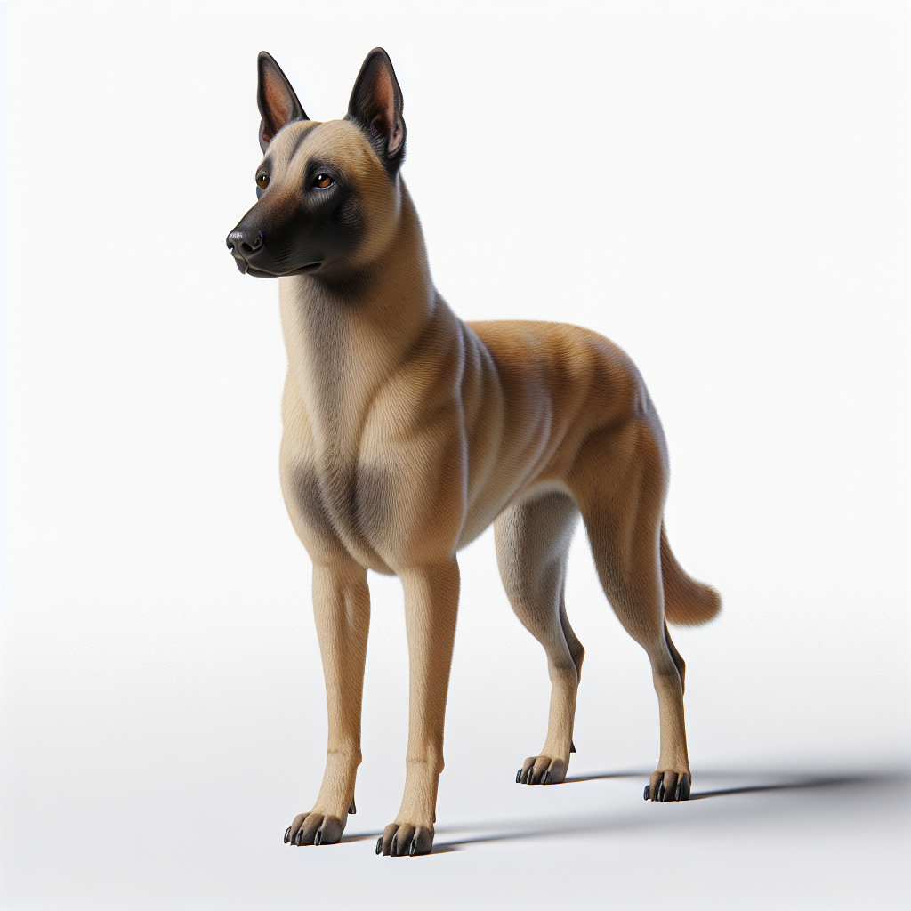
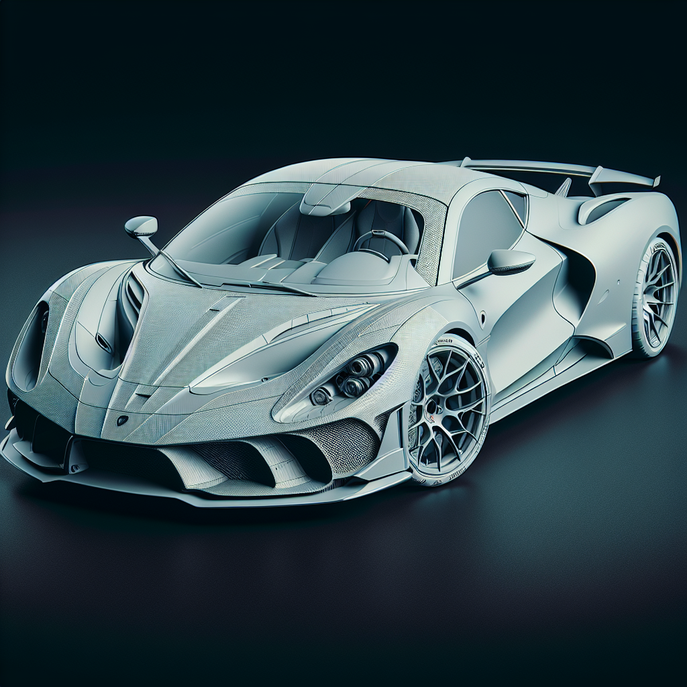
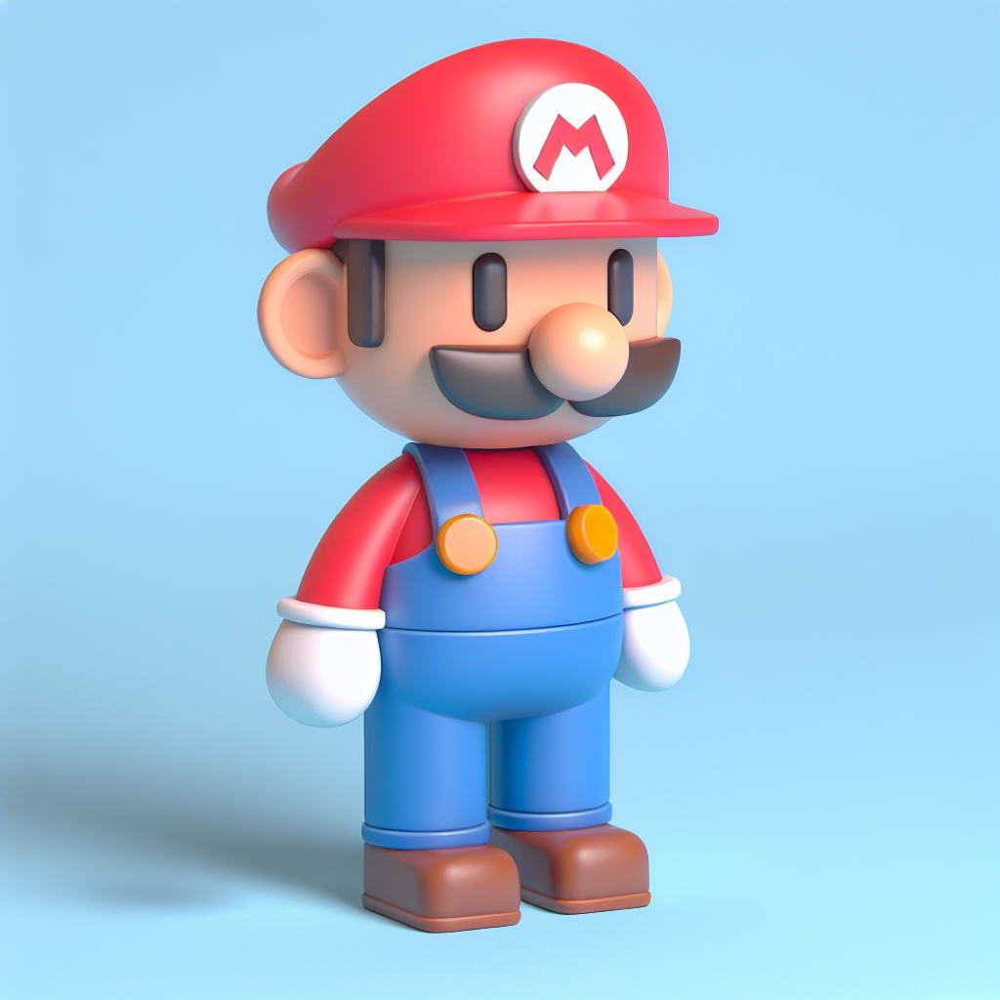
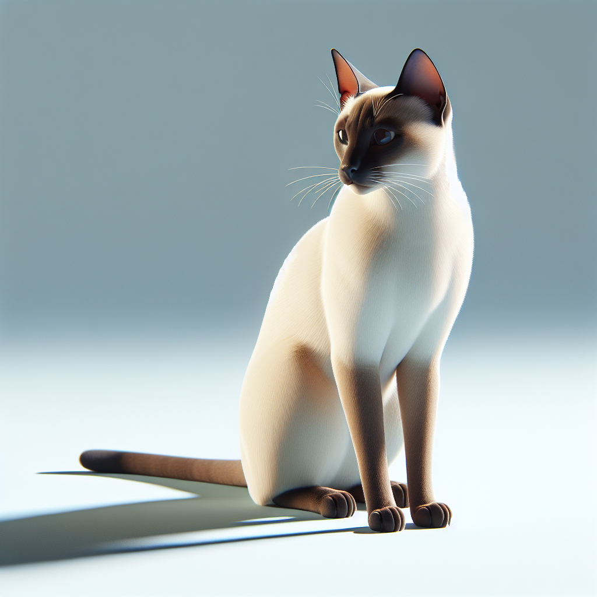
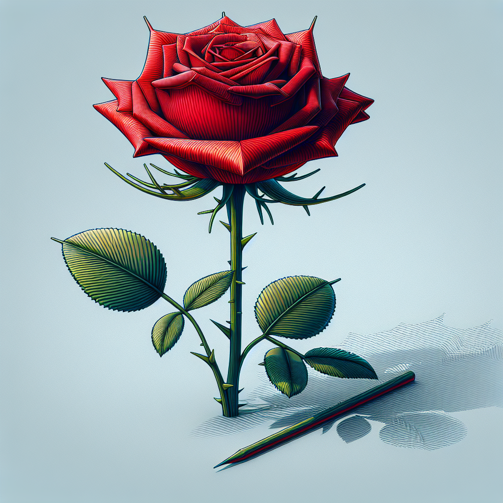

# generate-ornaments-from-text

## Overview

This is a simple set of scripts that generates 3D models from a set of objects described in text.

The basic pipeline is: text -> dalle3 -> dreamgaussian -> blender -> STL file

## 3D Models


## Images







## Usage

```bash
# Generate images to ./images
python3 get_images.py

# For each PNG, run the dreamgaussian pipeline against it
bash generate_3d_objects.sh
```